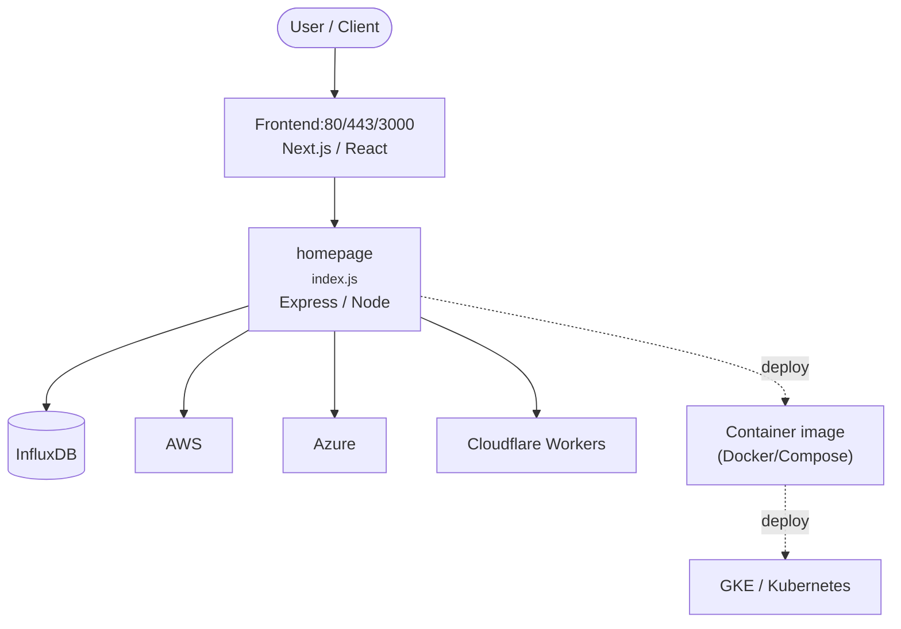

# Context Map — `homepage`

> Auto-generated architecture & deployment context map. Summarizes the core application, container/cloud footprint, and database connections. Regenerate after significant structural changes.

**Repo:** `avnit/homepage` · **Fork** · Public · Primary language: JavaScript · Default branch: `main` · Files: 1467

**Description:** A highly customizable homepage (or startpage / application dashboard) with Docker and service API integrations.

## 1. Core application

A modern, <em>fully static, fast</em>, secure <em>fully proxied</em>, highly customizable application dashboard with integrations for over 100 services and translations into multiple languages. Easily configured via YAML files or through docker label discovery.

- **Frameworks / runtime:** Express / Node, Next.js, React
- **Entry points:** `src/pages/api/services/index.js`, `src/pages/api/widgets/index.js`
- **Listens on port(s):** 80, 443, 3000, 8080, 1234, 2375

## 2. Containers & cloud applications

**Containers:**
- `.devcontainer/Dockerfile`
- `.devcontainer/devcontainer.json`
- `.dockerignore`
- `Dockerfile`
- `Dockerfile-tilt`
- `compose.yaml`

**Detected cloud platforms / services:** GKE / Kubernetes, AWS, Azure, Cloudflare Workers, GitHub Pages

## 3. Database connections

**Datastores in use:** InfluxDB

**Referenced in:**
- `env-configmap.yaml`
- `homepage-deployment.yaml`

**Environment / config files:** `k3d/.envrc`

> ⚠️ Non-template env files are committed: `k3d/.envrc`. Verify no live secrets are tracked.

## 4. Architecture diagram

## 5. Security posture

- **Dependabot alerts (open):** 3 critical, 48 high, 40 medium, 6 low
- **Static scan findings:** 4 high, 5 medium, 1 low

| Severity | Rule | File:Line |
|---|---|---|
| high | generic-secret-assign | `docs/widgets/info/longhorn.md:35` |
| high | generic-secret-assign | `src/__tests__/pages/api/widgets/openweathermap.test.js:55` |
| high | generic-secret-assign | `src/__tests__/pages/api/widgets/weather.test.js:43` |
| high | tls-verify-disabled | `src/utils/proxy/http.js:245` |
| medium | js-innerhtml | `config/custom.js:85` |
| medium | js-innerhtml | `config/custom.js:155` |
| medium | js-innerhtml | `config/custom.js:380` |
| medium | weak-hash | `docs/widgets/services/navidrome.md:17` |

---
_Generated by repo context-mapping pass on 2026-08-13._